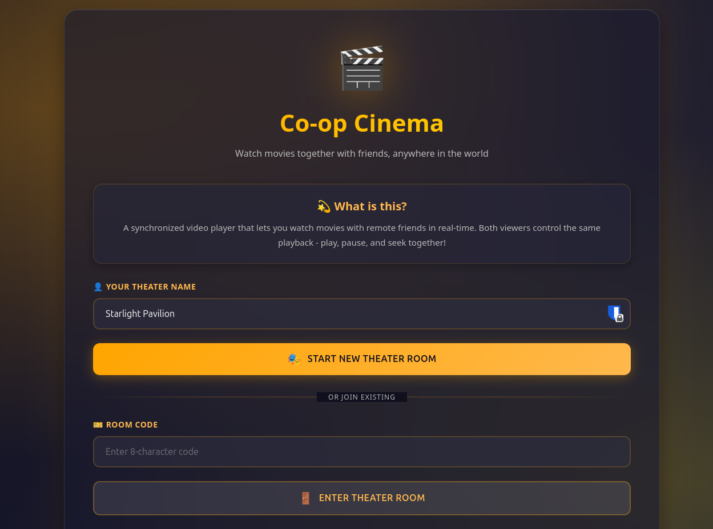
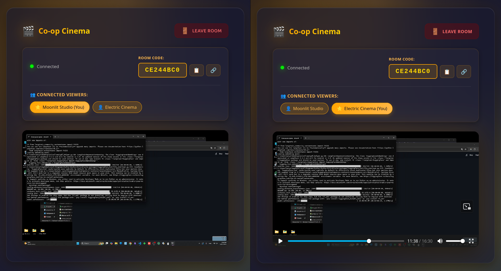

# Co-op Cinema

Real-time synchronized video player for watching videos together with friends, anywhere in the world. Supports YouTube, Vimeo, Twitch, Dailymotion, direct video URLs, and local files — all with synchronized playback controls, live chat, and reactions.




## Build & Run

```bash
# Build
GOOS=linux GOARCH=amd64 CGO_ENABLED=0 go build -o build/coopcinema

# Run
go run .
```

## Features

### Video Sources
- **Local files** — drag & drop or browse; no upload, files stay on your machine
- **YouTube** — paste any YouTube URL, embedded player with full sync
- **Vimeo** — Vimeo Player SDK integration with play/pause/seek sync
- **Twitch** — live streams (shared view) and VODs (seek-synced)
- **Dailymotion** — iframe embed with postMessage sync
- **Direct URLs** — any `.mp4`, `.webm`, or other browser-supported video URL
- **Auto-detection** — single URL input automatically detects the source type

### Room System
- Create or join rooms using unique 8-character codes
- Share via room code or full URL with pre-filled code
- Auto-generated theatrical names (e.g., "Stellar Cinema")
- Room persistence via localStorage with rejoin prompt on return
- Rooms auto-delete when empty

### Playback Synchronization
- Play, pause, and seek sync across all participants
- Smart threshold: only seeks if time difference > 0.5s to avoid jitter
- Debounced events (100ms play/pause, 200ms seek) to prevent rapid-fire lag
- Latency compensation using `sentAt` timestamps on sync messages
- Buffering sync: all peers pause when any peer is buffering, resume together
- Auto-state sync: new joiners receive the current video, timestamp, and play state

### Chat & Reactions
- Collapsible chat sidebar (slides over video on mobile)
- Floating action button to toggle chat
- Reaction emoji bar (6 emojis) with float-up animation overlay on the video

### Host/Viewer Roles
- Room creator becomes host by default
- Host mode toggle: when on, only the host's playback controls send sync messages
- Transfer host to another user by clicking their badge
- Crown icon on the host's user badge

### Playback Status Indicators
- User badges show play/pause/buffering icons
- Status updates sent on state change and every 5 seconds

## Technical Architecture

### Backend (Go)
- **Stateless WebSocket relay** — broadcasts JSON messages to all room clients except sender
- **Room-based hub system** with isolated message broadcasting per room
- **Ping/pong keepalive** at 54s intervals with 60s timeout
- **Automatic cleanup** of disconnected clients and empty rooms
- No playback logic on the server; all sync handled client-side

### Frontend (HTML/JS/CSS)
- Single-page application with lobby and room views
- WebSocket client with auto-reconnection (3s delay)
- Glassmorphism UI with theater-themed design
- Responsive layout with mobile chat overlay
- No frontend framework — native browser APIs plus player SDKs

### Message Protocol
```json
{
  "type": "play|pause|seek|youtube|vimeo|twitch|dailymotion|directurl|chat|reaction|status|state|buffering|bufferend|hostchange|hostmodeoff|userList",
  "timestamp": 123.45,
  "userID": "abc123xyz",
  "userName": "Stellar Cinema",
  "url": "videoIdOrUrl",
  "content": "message text or emoji or status",
  "sentAt": 1706000000000,
  "sourceType": "youtube|vimeo|twitch|dailymotion|file|none",
  "playing": true
}
```

### Sync Optimizations
- **Event batching**: 50ms timeout to group rapid events
- **Time threshold**: 0.5s minimum difference before seeking
- **Local action flag**: prevents echo loops
- **Latency offset**: receiver adjusts seek target by estimated one-way delay
- **Buffering coordination**: tracks a `peersBuffering` set; pauses when non-empty, resumes when cleared

## Dependencies
- `gorilla/websocket` (Go) — WebSocket implementation
- [YouTube IFrame API](https://developers.google.com/youtube/iframe_api_reference)
- [Vimeo Player SDK](https://developer.vimeo.com/player/sdk)
- [Twitch Embed API](https://dev.twitch.tv/docs/embed/)
- Dailymotion iframe postMessage API

## Use Cases
- Remote watch parties with friends and family
- Synchronized video presentations across locations
- Collaborative video review sessions
- Distance learning with synchronized lecture videos
