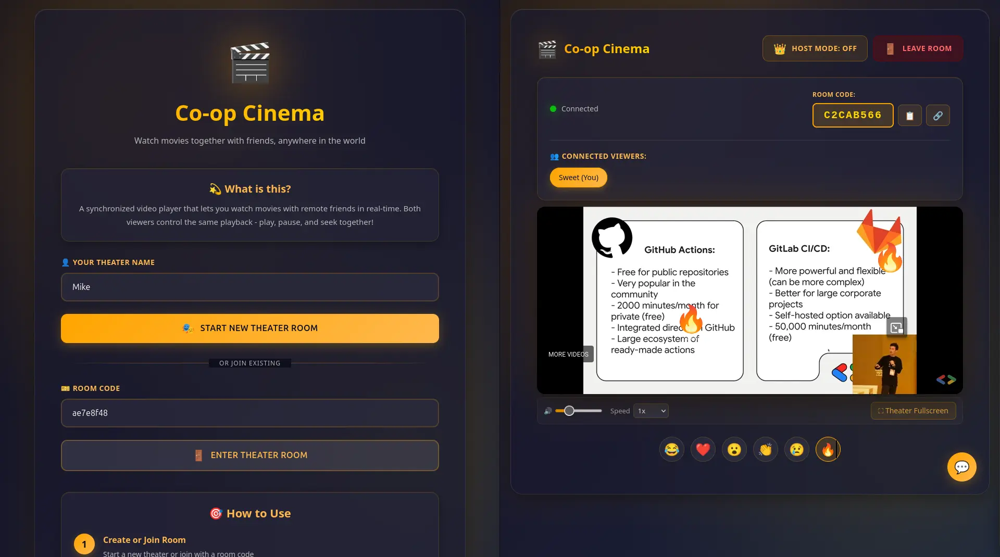
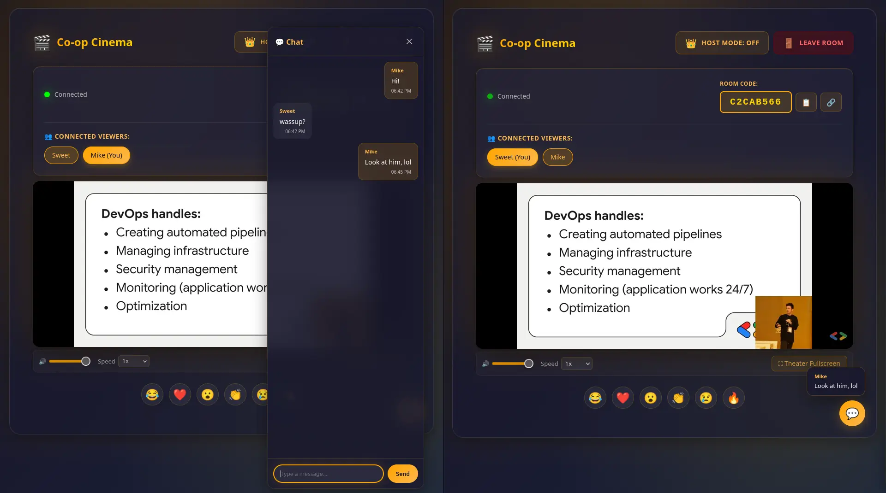
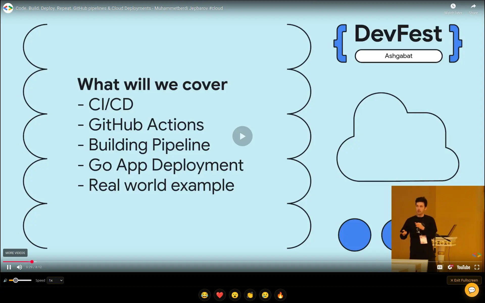

# Co-op Cinema

Real-time synchronized video player for watching videos together with friends, anywhere in the world. Supports YouTube, Vimeo, Twitch, Dailymotion, direct video URLs, and local files — all with synchronized playback controls, live chat, and reactions.

A weekend project born out of a simple pain: wanting to watch YouTube videos with friends who are far away. Built with Go and vanilla JS. No frameworks, no complexity — just WebSockets and browser APIs.

Demonstrated at [DevFest Ashgabat 2025](https://gdg.community.dev/events/details/google-gdg-ashgabat-presents-devfest-ashgabat-2025-a-glimpse-into-the-future-of-tech/) by GDG Ashgabat as part of the talk *"Code. Build. Deploy. Repeat. GitHub Pipelines & Cloud Deployments for Go"* — [YouTube](https://youtu.be/yfzkSp3TlT4) / [Slides](https://docs.google.com/presentation/d/14vg2_i91qOmdQ1yzyZTImcgbh_ejWJ8Oi3I729aS3wA/edit?usp=sharing)





## Quick Start (Docker — one command)

```bash
cp .env.example .env
docker compose up -d
```

Open [http://localhost:8080](http://localhost:8080) — done.

To stop: `docker compose down`

## Setup

### Docker (recommended)

```bash
git clone https://github.com/youruser/coopcinema.git
cd coopcinema
cp .env.example .env    # edit .env if needed
docker compose up -d
```

### Without Docker

Requires Go 1.23+

```bash
git clone https://github.com/youruser/coopcinema.git
cd coopcinema
cp .env.example .env
go run .
```

### Build binary

```bash
GOOS=linux GOARCH=amd64 CGO_ENABLED=0 go build -o build/coopcinema
./build/coopcinema
```

## Configuration

All settings are in `.env` (copy from `.env.example`):

| Variable | Default | Description |
|---|---|---|
| `SERVER_ADDR` | `:8080` | Listen address (`host:port`) |
| `PORT` | `8080` | Port only (used by Render, Railway, Fly.io) |

`SERVER_ADDR` takes priority. If not set, falls back to `PORT`, then defaults to `:8080`.

## Deploy to Cloud (free)

### Render

1. Push repo to GitHub
2. Go to [render.com](https://render.com) → New → Web Service
3. Connect your repo
4. Settings: **Runtime** = Docker, **Plan** = Free
5. Deploy — Render builds the Dockerfile automatically

Or use the blueprint: **New** → **Blueprint** → select repo → it reads `render.yaml` automatically.

### Fly.io

```bash
flyctl launch        # creates fly.toml
flyctl deploy        # builds & deploys
```

### Railway

1. Go to [railway.app](https://railway.app) → New Project → Deploy from GitHub
2. Select repo — Railway auto-detects the Dockerfile
3. Add env var `SERVER_ADDR=:8080` if needed

## Features

### Video Sources
- **Local files** — drag & drop or browse; no upload, files stay on your machine
- **YouTube** — paste any YouTube URL, embedded player with full sync, custom volume and speed controls
- **Vimeo** — Vimeo Player SDK integration with play/pause/seek sync
- **Twitch** — live streams (shared view) and VODs (seek-synced)
- **Dailymotion** — iframe embed with postMessage sync
- **Direct URLs** — any `.mp4`, `.webm`, or other browser-supported video URL
- **Auto-detection** — single URL input automatically detects the source type

### Room System
- Create or join rooms using unique 8-character codes
- Share via room code or full URL with pre-filled code
- Auto-generated theatrical names (e.g., "Stellar Cinema")
- Room persistence via localStorage with rejoin prompt on return
- Rooms auto-delete when empty

### Playback Synchronization
- Play, pause, and seek sync across all participants
- Smart threshold: only seeks if time difference > 0.5s to avoid jitter
- Debounced events (100ms play/pause, 200ms seek) to prevent rapid-fire lag
- Latency compensation using `sentAt` timestamps on sync messages
- Buffering sync: all peers pause when any peer is buffering, resume together
- Auto-state sync: new joiners receive the current video, timestamp, and play state

### Chat & Reactions
- Collapsible chat sidebar with slide-in animation
- Chat FAB button (visible only inside a room)
- Toast popup notifications when chat is closed (stack up to 5, auto-dismiss, click to open chat)
- Notification sound via Web Audio API
- Reaction emoji bar (6 emojis) with float-up animation overlay
- Reactor's name displayed under each floating emoji
- All overlays visible in Theater Fullscreen mode

### Theater Fullscreen
- Custom fullscreen using the Fullscreen API on the video wrapper
- Keeps reactions, chat toasts, chat sidebar, and controls visible — unlike native YouTube fullscreen
- ESC key support, fullscreen state synced via event listeners

### Host/Viewer Roles
- Room creator becomes host by default
- Host mode toggle: when on, only the host's playback controls send sync messages
- Transfer host to another user by clicking their badge
- Crown icon on the host's user badge

### Playback Status Indicators
- User badges show play/pause/buffering icons
- Status updates sent on state change and every 5 seconds

## Technical Architecture

### Backend (Go)
- **Stateless WebSocket relay** — broadcasts JSON messages to all room clients except sender
- **Room-based hub system** with isolated message broadcasting per room
- **Ping/pong keepalive** at 54s intervals with 60s timeout
- **Automatic cleanup** of disconnected clients and empty rooms
- No playback logic on the server; all sync handled client-side

### Frontend (HTML/JS/CSS)
- Single-page application with lobby and room views
- WebSocket client with auto-reconnection (3s delay)
- Glassmorphism UI with theater-themed design
- Responsive layout with mobile chat overlay
- No frontend framework — native browser APIs plus player SDKs

### Message Protocol
```json
{
  "type": "play|pause|seek|youtube|vimeo|twitch|dailymotion|directurl|chat|reaction|status|state|buffering|bufferend|hostchange|hostmodeoff|userList",
  "timestamp": 123.45,
  "userID": "abc123xyz",
  "userName": "Stellar Cinema",
  "url": "videoIdOrUrl",
  "content": "message text or emoji or status",
  "sentAt": 1706000000000,
  "sourceType": "youtube|vimeo|twitch|dailymotion|file|none",
  "playing": true
}
```

### Sync Optimizations
- **Event batching**: 50ms timeout to group rapid events
- **Time threshold**: 0.5s minimum difference before seeking
- **Local action flag**: prevents echo loops
- **Latency offset**: receiver adjusts seek target by estimated one-way delay
- **Buffering coordination**: tracks a `peersBuffering` set; pauses when non-empty, resumes when cleared

## Dependencies
- `gorilla/websocket` (Go) — WebSocket implementation
- [YouTube IFrame API](https://developers.google.com/youtube/iframe_api_reference)
- [Vimeo Player SDK](https://developer.vimeo.com/player/sdk)
- [Twitch Embed API](https://dev.twitch.tv/docs/embed/)
- Dailymotion iframe postMessage API

## Use Cases
- Remote watch parties with friends and family
- Synchronized video presentations across locations
- Collaborative video review sessions
- Distance learning with synchronized lecture videos
- Live deployment demos and testing

## Support

Built by **Mike (Muhammetberdi) Jepbarov**.

If you find this project useful or fun — give it a star on GitHub, share it with friends, or just watch something together. That's the best support there is.

[](https://github.com/mikebionic/coopcinema)

- [GitHub](https://github.com/mikebionic)
- [LinkedIn](https://www.linkedin.com/in/muhammetberdi-jepbarov/)
- [YouTube — DevFest talk](https://youtu.be/yfzkSp3TlT4)
